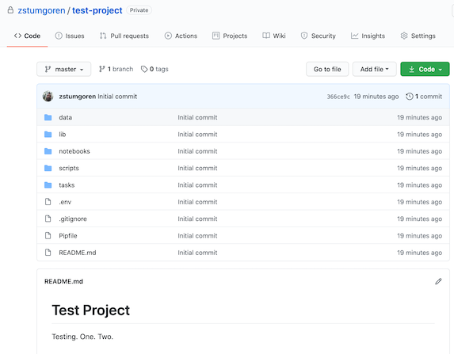

# Automating workflow with DataKit

- [Overview](#overview)
- [Install](#install)
- [Preview](#preview)
- [First project](#first-project)
- [Daily use](#day-to-day-with-datakit)

## Overview

In this course we'll dip into the culture of [newsroom automation](automating_workflows.md) by using [DataKit][], an open-source command-line tool created by The Associated Press. DataKit was [designed in a team environment][] to bring sanity to data projects. Among other things, it helps standardize project structures, easily share code and data with teammates, and even publish data as part of story packages.

[DataKit]: https://datakit.ap.org/
[designed in a team environment]: https://rjionline.org/news/aps-datakit-helping-teams-collaborate-efficiently/

It also makes it easy to customize workflows to suit different teams and individuals. We've customized DataKit for use in the classroom.

DataKit will help us streamline our workflow while applying best practices from the worlds of data science and software. Among other things, it will help us:

* Create standard project structures for all code work
* Use [virtual environments](https://docs.python.org/3/tutorial/venv.html) for Python (using [pipenv][])
* Save code and data in [version control](https://en.wikipedia.org/wiki/Version_control) ([git][])
* Publish our work to GitHub, making it easy to open-source if we choose
* Easily share our work with instructors

[git]: https://git-scm.com/book/en/v2
[pipenv]: https://pipenv.pypa.io/en/latest/#pipenv-python-dev-workflow-for-humans

See [here](https://github.com/stanfordjournalism/cookiecutter-stanford-progj) for more details on our classroom workflow and customizations.


## Install

Follow the steps in [Tech Setup - DataKit](tech_setup.md#datakit). *Note, you must first work through the preceding steps in the Technical Setup.*

## Preview

When you run DataKit on the command line, it will ask you a series of questions that help configure the new project. The questions will often have default values shown in square brackets `[]`. 

You can simply hit `return` to accept the defaults, or type in an answer as necessary. Below is an example session demonstrating the workflow.

At the end, we display the contents of the generated project. 


Some important bits to note:

* A new project folder (i.e. a new git repository) has been created on your local machine: `test-project/`
* A corresponding GitHub project has been created, in this example, at `https://github.com/zstumgoren/test-project`. This GitHub project is linked to the newly created *local* repository, so that you can easily push local changes back to GitHub.
* The new GitHub project is private, because we accepted that as the default when prompted. We'll generally create private projects at the outset, although you have the option to later make them public.
* If you look inside the new `test-project/` folder on your machine, you should see a bunch of initial project files and directories have been created.
* The project includes a `README.md` that contains reminders on [daily workflow](#day-to-day-with-datakit).

If you visit the GitHub project, you would see that these files have been saved to GitHub as well.




## First project

The first time you run DataKit will be a little bit different than subsequent uses. On this first run, we need to specify a [template on GitHub](https://github.com/stanfordjournalism/cookiecutter-stanford-progj) that we'll use to auto-generate our projects. This template contains the boilerplate files common to all projects. It helps us streamline the process of generating a standardized project structure.

When you first run DataKit, it will install this template locally, simplifying future usage.

To kick off the process, run the following. 

> Type "Test Project" when prompted for the `project_name`. For all other prompts, hit `return` to accept the default values.

```
datakit project create --template gh:stanfordjournalism/cookiecutter-stanford-progj
```

This process prints a lot of information to the shell. Take note in particular of the URL for the auto-generated GitHub project (e.g. <https://github.com/zstumgoren/test-project>).


You'll also see some reminders about next steps for working with the new project -- specifically, navigating into the newly created repository on your shell and installing some Python libraries.

```
# Navigate to the newly created project folder
cd test-project/

# Install Python dependencies
pipenv install
```

Next, you should activate the virtual environment:

> Note, this is mainly needed for Python work, but it's a good habit in general. We'll talk in class about why.

```
pipenv shell
```

At this point, you could add new files to the project, for example a Python or Bash script. Normally you'll use a text editor such as Visual Studio Code to create and save new files.

Just make sure to save code files somewhere *inside* this newly created project folder. A Bash or Python script, for example, should go in the `scripts/` directory.

### The git two-step

You should think of this new project folder as much more than a mere collection of files and directories. Instead, it's more akin to a system for storing all of the incremental changes made to your files over time. This is an incredibly powerful and [useful way of working](https://www.git-tower.com/learn/git/ebook/en/command-line/basics/why-use-version-control/), but it does require a bit more overhead to manage.

With this type of workflow, saving code in your text editor is the first part of a multi-step "saving" process. You also need to save your code using the [git][] version control system.

We've provided some basic shell commands that will simplify the process of saving code to your local git repository and "pushing" those changes to GitHub.

To use the commands, make sure you've navigated *inside* the project directory:

```
# Navigate to the project folder
cd test-project/

# Activate the environment, if you haven't already
pipenv shell 

# Save your work locally to git
invoke code.save
```

Once you've saved changes locally, you can "push" those changes up to GitHub.

```
invoke code.push
```

When you're done working, deactivate the virtual environment:

```
exit
```

Congratulations, your work should now be saved in a private repo on GitHub!!

## Day-to-day with DataKit

In the future, you can use DataKit to create new projects by simply running `datakit project create`, followed by the other commands mentioned above.

You should get into the habit of saving and publishing your work to GitHub whenever you add, change or delete files. This applies to both code and data files.

If you're making changes to a previously created project, you won't need all of the commands mentioned above. 

Here's the short list of commands you'll need when working with an existing project:

> Note: Every project's `README.md` includes reminders on this workflow.

```
# Navigate to the project folder
cd test-project/

# Install Python dependencies, typically
# after the project is first created
pipenv install

# Activate a sandboxed environment for this project
pipenv shell

# Save your work locally to git
invoke code.save

# Push work to GitHub
invoke code.push

# When you're done working,
# deactivate the virtual environment
exit
```
