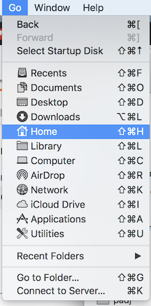
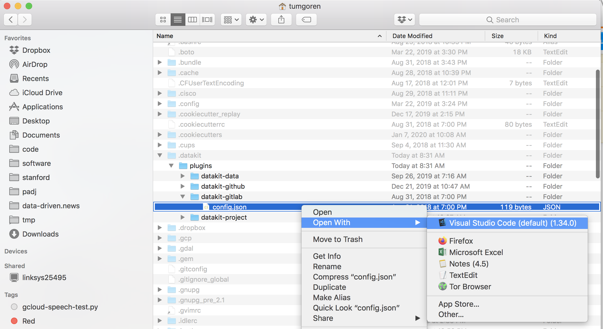

# Technical FAQs


### How do I prettify my shell prompt?

> Note, depending on how your shell is set up, you may need to place the below environment variable in a different configuration file such as `~/.bash_profile`, `~/.bashrc`.

1. Open the Terminal
1. Paste the following command: `echo "PS1='\w> '" >> ~/.profile`
1. Hit enter
1. Close the Terminal and re-open a new Terminal

You should see a prompt that looks like this: `~>`

### How do I silence zsh shell warning?

Open Terminal.

```bash
echo "export BASH_SILENCE_DEPRECATION_WARNING=1" >> ~/.profile
```

Close and re-open Terminal


### How do I open code in VS Code from the terminal?

There are a [few options](https://code.visualstudio.com/docs/setup/mac),
but one easy way is to create a shell *alias* in the appropriate configuration file.

> Depending on how your system is set up, this file wil vary but typically it will be `~/.profile` or `~/.bash_profile` for Mac users *in this class*, or `~/.bashrc` for Linux users.

You'll need to locate the Visual Studio Code program on your system, and use that to set up the alias.

For example, on my machine:

```bash
# e.g. in ~/.profile

alias vscode="/Applications/Visual\ Studio\ Code.app/Contents/Resources/app/bin/code"
```

Once set, **start a new terminal.** Then you should be able to do the following on the command line:

```bash
# This should open up a new file called awesome_new_scripy.py in VS Code
vscode awesome_new_script.py
```

### Why won't X install on Mac Catalina?

Some students reported warnings about "malicious" software when trying to install VSCode or Atom code editors on Mac Catalina.

This [StackOverflow post](https://stackoverflow.com/questions/58457958/visual-studio-code-cant-be-opened-because-apple-cannot-check-it-for-malicious) has a temporary work-around. Probably worth trying the simpler solution first (`System Preferences > Security & Privacy`).

### Why are basic shell commands missing on Mac Catalina?

Mac users who have upgraded to Catalina reported that they don't have basic shell utilities such as `ls`, `cp`, etc. in the Terminal.

Running `xcode-select --install` appears to fix the problem.

> Note: This is one of the steps you need to run in our [technical setup](tech_setup.md), so please make sure to only run it once.

### Which Ubuntu should I use? 

Typically, you'll want the latest "LTS" release from the [Ubuntu download page](https://ubuntu.com/download/desktop).

### How do I edit hidden files on a Mac?

Mac and Linux systems contain hidden files and directories that typically contain configuratons for various programs on the system. An example is `~/.bashrc`, which contains configurations for the bash shell.

These files can be opened and edited with a standard code editor such as Visual Studio Code or Atom. 

> For this example, we assume you have Visual Studio Code installed.

In order to edit such files, you should open a Finder window.

Hit `command` + `shift` + `.` to make invisible files and folders appear in the Finder.

Use the Finder menu to navigate to your Home directory using `Go -> Home`.



You should now see your home directory, which contains a number of hidden files and directories starting with a `.`. For this example, let's assume we want to edit a hidden configuration file for DataKit.

Navigate to the `~/.datakit/plugins/datakit-github` folder.

Right-click on `config.json`.

You should get a pop-up menu with options for opening the file using different programs.

Choose `Open With` and select a code editor such as Visual Studio Code or Atom to open and edit the file.



If you wish to once again hide these `.`-prefixed files and directories, hit `command` + `shift` + `.` once again in the Finder window.
